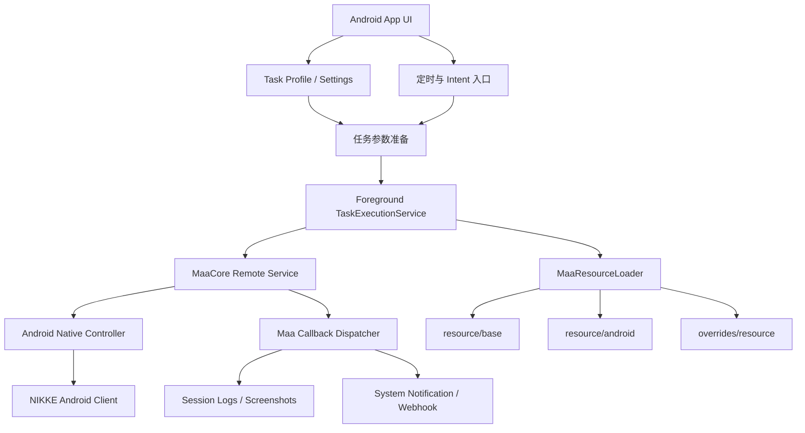

# NIKKE 安卓端 MAA 工具设计稿

本文设计一个可在 Android 设备端运行的 NIKKE 自动化工具，暂定名 `MaaNikke-Android`。设计参考：

- [Aliothmoon/MAA-Meow](https://github.com/Aliothmoon/MAA-Meow)：Android APK 外壳、Shizuku/root 远程服务、MaaCore 生命周期、虚拟显示、任务配置、日志、通知和外部 Intent 调度。
- [Shinarin/MaaNikke](https://github.com/Shinarin/MaaNikke)：NIKKE 任务拆分、`interface.json`、MaaFramework v2 pipeline、每日任务资源结构和用户选项。
- MaaFramework 文档：ProjectInterface V2、Pipeline 协议、Android Native / ADB 控制方式。

目标不是做封包、注入或内存读取工具，而是一个基于截图识别和触控输入的黑盒自动化助手。

## 目标与边界

### 目标

- 在 Android 9+ 设备或模拟器上运行，不依赖 Windows PC 持续控制。
- 通过 MaaCore + Android Native 控制完成截图、识别、点击和滑动。
- 复用 MaaNikke 的任务心智模型：启动游戏、回主页、登录奖励、免费商店、前哨防御、派遣、好友点、邮件、每日奖励等。
- 通过任务配置 profile 控制执行顺序、启用状态和保守选项。
- 保留可复盘日志、截图、命中结果和最终报告。

### 非目标

- 不做 APK 内注入、内存读取、封包分析、登录绕过、反检测或 Hook。
- V1 不直接适配所有手机物理全屏比例。优先在 App 内创建固定 16:9 游戏运行容器，让 NIKKE 在该显示环境中运行。
- V1 不做高风险自动战斗决策、钻石消耗、联盟突袭自动出刀。相关功能默认关闭，只保留识别/提醒/只读采样入口。
- 不直接搬运上游图片、模型、代码作为正式发布内容。若后续使用，需要确认许可证和署名。

## 总体架构



设计采用“MAA-Meow 外壳 + MaaNikke 资源”的分层：

- APK 外壳：Kotlin/Android，负责权限、服务、UI、配置、任务启动、日志、通知、更新。
- MaaCore 层：通过 Android native `.so` 在设备侧运行，接收任务参数和资源路径。
- 控制器层：优先使用 `MaaAndroidNativeControlUnit`，以 Android 原生截图与触控为目标；调试期可提供 ADB 连接模式作为备用。
- 资源层：NIKKE 的 pipeline、模板图、OCR 模型、Android 专用覆盖资源。

## Android 运行链路

### 权限与运行模式

V1 支持两种运行模式：

- App 内 16:9 运行模式：参考 MAA-Meow，使用 Shizuku/root 创建虚拟显示或受控显示容器，将 NIKKE 启动到该显示中，MAA 对这个固定比例 display 截图和触控。优先实现。
- 物理前台调试模式：直接控制当前手机横屏画面，用于截图采样、验证包名/Activity 和兜底调试，不作为主适配目标。

前置要求：

- Android 9+，建议 Android 11+。
- `arm64-v8a` 优先，后续按需支持 `x86_64` 模拟器。
- Shizuku 已运行并授权，或设备已 root。
- NIKKE 已安装、可正常登录，过场动画/画质设置已按低干扰模式配置。
- 需要 root 或 Shizuku 权限启动受控显示和远程服务。当前 Mi 10 Pro 已验证 root 与 Shizuku 均可用。
- 物理屏幕比例不要求 16:9；App 内运行容器应固定为 `1280x720` 或 `1920x1080`。

### 分辨率与坐标适配

NIKKE 直接前台运行时会跟随手机横屏比例。Mi 10 Pro 当前物理截图为 `2340x1080`，比例约 `19.5:9`，游戏 UI 会利用两侧宽屏空间，不能直接复用 PC/MaaNikke 的 16:9 ROI。

但 MAA-Meow 的目标形态是另一种：App 内创建一个 16:9 的游戏运行/预览容器，让游戏在该 display 中渲染。这样任务资源可以稳定在 `1280x720` 或 `1920x1080` 坐标系下开发。

V1 坐标策略：

- 主资源使用 16:9 坐标系。MVP 建议 `base_size = 1280x720`，高清档为 `1920x1080`。
- App 启动 NIKKE 时优先创建 16:9 虚拟显示，例如 `1280x720@160dpi` 或 `1920x1080@240dpi`，并把 NIKKE 启动到该显示。
- Controller 的 `screen_resolution` 必须等于虚拟显示分辨率，例如 `1280x720`。
- 物理前台调试模式保留 `2340x1080` 适配记录，但不作为默认资源坐标。若直接控制物理前台画面，则进入校准/只读模式，避免误点击。
- Mi 10 Pro 前台物理截图的 16:9 安全区为 `[210, 0, 1920, 1080]`，可用于对照检查虚拟显示与物理全屏的布局差异。

### MaaCore 启动流程

参考 MAA-Meow 的 `MaaCompositionService`：

1. App 检查资源是否初始化：`version.json`、App 版本标记、资源目录存在。
2. 连接 RemoteService：Shizuku/root 绑定远程进程。
3. 创建 MaaCore 实例并注册 callback。
4. 设置实例选项：`TouchMode = Android`，必要时设置其他 Android 触控选项。
5. 获取当前显示分辨率和 `display_id`。
6. 构造 Android Native controller 配置：

```json
{
  "library_path": "libMaaAndroidNativeControlUnit.so",
  "screen_resolution": {
    "width": 1280,
    "height": 720
  },
  "display_id": "<virtual_display_id>",
  "force_stop": false
}
```

7. 加载资源：`resource/base` -> `resource/android` -> `cache/resource` -> `overrides/resource`。
8. 按 profile 追加任务并启动。
9. callback 更新任务状态、日志、截图与通知。

### App 内 16:9 模式策略

App 内 16:9 模式是正式目标：

- 资源坐标稳定，能复用 MaaNikke/MAA 常见 16:9 pipeline 思路。
- UI 可在 App 内显示游戏预览、任务开关、日志、通知。
- 手机物理比例、刘海和导航条对任务 ROI 的影响大幅降低。

限制：

- 必须验证 NIKKE 能否稳定运行在虚拟显示/受控显示容器中。
- 需要 root/Shizuku 启动远程服务和显示容器。
- 需要处理停止任务后关闭或回收虚拟显示。

### 2026-06-17 实机验证结论

Mi 10 Pro（Android 13、root、Shizuku 可用）已经验证 `1280x720@160dpi` 这条链路可行：

- 普通 APK 的 `TextureView` 虚拟显示可以承载 NIKKE Activity，但公开预览帧保持黑屏，`screencap -d <display-id>` 也不可用。因此不要把公开 `TextureView.getBitmap()` 作为正式截图方案。
- root/app_process 方式创建 MAA-Meow 风格虚拟显示，并将 `ImageReader RGBA_8888` 作为 sink，可以抓到真实 NIKKE 帧。
- 最新验证入口为 `tools/android_root_imagereader_probe/run_root_probe.ps1`，最新结果写入 `outputs/android_probe/root_ir_probe/*_latest.*`。
- 最新真机回归：`displayId=9`、`frames=422`、`nonBlackFrames=388`、`touchDownResult=true`、`touchUpResult=true`。点击虚拟显示坐标 `(32,86)` 后，`outputs/android_probe/root_ir_probe/maanikke_root_ir_after_touch_latest.png` 显示 NIKKE 公告弹窗。
- 这说明后续 Android 端主路线应是 root/Shizuku remote process + `ImageReader`/native frame buffer + display-bound `MotionEvent`，而不是物理 `2340x1080` 屏幕适配。
- 调试 APK `outputs/android_probe/apk/MaaNikkeAndroidDebug.apk` 已内置早期 `start_game`、`back_to_home`、`handle_update`、`claim_mail` 任务，并新增安全页面巡检任务 `visit_mail`、`visit_daily_rewards`、`visit_friend_points`、`visit_free_shop`、`visit_outpost_defense`。任务队列默认勾选安全巡检节点，只进入页面并截图留证，不点击领取、购买或派遣。
- APK 前端已参考 Bilibili `BV1reLp6GEeF`（MAA-Official「安卓牛」/ MAA-Meow 教程）和 `.tmp_MAA-Meow/docs/screenshots/` 改为浅色竖屏任务面板：顶部状态、分割区块内横向 16:9 实时游戏预览、运行概览、一键长草/自动战斗/小工具/日志标签、任务配置列表、固定底部操作栏和底部导航。游戏不直接占用物理屏幕比例，而是继续运行在 `1280x720@160dpi` 虚拟显示中。底部栏以 `开始任务`/`停止任务`/`导出日志` 为主，少量快捷按钮仅用于调试单节点。
- 任务页已加入 `workflow_daily_safe`，参考 MAA-Meow `TaskProfile -> TaskChainNode` 的任务链模型，把勾选节点作为后端参数连续执行，并复用同一个 root/app_process 与虚拟显示生命周期。外部触发入口为 `com.codex.maanikke.debug.RUN_WORKFLOW_DAILY_SAFE`。
- 实时预览已从 APK 轮询 `/data/local/tmp/maanikke_root_ir_last.png` 升级为 LocalSocket/JPEG 内存帧，并在 2026-06-17 改为长连接流式读取。后端 `PreviewFrameServer` 监听抽象 socket `maanikke_preview_frame`，连接后连续推送 `seq + jpegLength + jpegBytes`，`FrameCaptureBackend` 每约 90ms 更新最新 JPEG；PNG 文件只作为降级预览和任务证据保留。曾尝试 `127.0.0.1` TCP 服务，但 `su 2000` 后端在当前设备上创建 `ServerSocket` 会被拒绝，已改用 Android `LocalServerSocket/LocalSocket`。
- 2026-06-17 已直接拆包 `C:\Users\Administrator\Downloads\MaaMeow-v0.14.3-arm64-v8a.apk`，输出目录为 `outputs/android_probe/maameow_apk_unpack/`。MaaMeow v0.14.3 的 APK 结构要点：Manifest 声明 Shizuku 权限、无障碍、悬浮窗、外部存储、前台服务、通知、电量优化、安装包权限和定时能力；组件包含 `MaaApplication`、`MainActivity`、`AccessibilityHelperService`、`TaskExecutionService`、`ScheduleExecutionService`、`ScheduleReceiver`、`BootReceiver`、`ShizukuProvider`、`RootServiceBootstrapProvider`、`FileProvider`；native 库包含 `libMaaCore.so`、`libMaaAndroidNativeControlUnit.so`、`libMaaUtils.so`、`libfastdeploy_ppocr.so`、`libonnxruntime.so`、`libopencv_world4.so` 等；资源层是 `assets/MaaSync/MaaResource/` + `assets/MaaSync/asset_manifest.json` + `assets/overrides/`。
- 当前调试 APK 已先按 MaaMeow 的资源层形态内置 `assets/MaaSync/MaaResource/interface.json` 和 MaaNikke PC `resource/base`，并生成 `assets/MaaSync/asset_manifest.json`。`TaskCatalog` 已按 MaaNikke PC `interface.json` 顺序导入 23 个任务 entry，UI 展示完整 PC 任务目录；2026-06-17 已补齐 22 个非测试 entry 的 Android adapter 覆盖，`test` 仍禁用。低风险节点走 `visit_*` 安全访问，高风险节点先走 `manual_confirm_*` 或 `readonly_*` 状态回执，不默认购买、领取、派遣、升级、招募、战斗或出刀。这一步实现的是 APK 壳层/资源层/任务目录/后端路由对齐，尚不是 MaaCore native 执行等价。
- 跨设备启动已从硬编码 `com.tencent.nikke/.default_Activity` 改为自动解析：后端 `GameLauncher` 会读取 `/data/local/tmp/maanikke_target_component.txt` 或 `/data/local/tmp/maanikke_target_package.txt` 手动覆盖，其次扫描候选包名和设备上已安装的 `nikke` 包，并通过 `cmd package resolve-activity`/`monkey` 找 launcher Activity。任务结果会写出 `targetPackage`、`targetComponent`、`targetSource`，用于判断其他设备失败时是包名、Activity、root 还是虚拟显示问题。
- App 图标已替换为用户给定图片 `C:\Users\Administrator\Desktop\b_a41c13f05f371b1bbba29b57ab402acc.jpg`，生成到 `tools/android_maanikke_debug_apk/res/mipmap-*/ic_launcher*.png`。
- 最新 APK 回归：`start_game` 为 `displayId=29`、`frames=664`、`nonBlackFrames=601`、`actionCount=5`、`actionSuccess=true`、`finalState=home_clear`，证据在 `outputs/android_probe/apk_regression_after_feature_start_game/`；`back_to_home` 为 `displayId=30`、`frames=524`、`nonBlackFrames=477`、`actionCount=7`、`actionSuccess=true`、`finalState=home_clear`，证据在 `outputs/android_probe/apk_regression_after_feature_back_to_home/`；`handle_update` 为 `displayId=32`、`frames=469`、`nonBlackFrames=414`、`actionCount=0`、`actionSuccess=true`、`finalState=no_update_or_download_dialog`，证据在 `outputs/android_probe/apk_handle_update_run_iter2/`；`claim_mail` 可领取路径为 `displayId=34`、`actionSuccess=true`、`finalState=mail_claimed_home_clear`，证据在 `outputs/android_probe/apk_claim_mail_run_iter2/`，无可领邮件路径为 `displayId=36`、`actionSuccess=true`、`finalState=home_clear`，证据在 `outputs/android_probe/apk_claim_mail_run_iter4/`。
- MaaMeow 架构适配后的 APK 已构建、安装并打开验证，桌面导出路径为 `C:\Users\Administrator\Desktop\MaaNikkeAndroidDebug.apk`，构建产物为 `outputs/android_probe/apk/MaaNikkeAndroidDebug.apk`，大小约 19 MB。UI 截图为 `outputs/android_probe/apk_maameow_arch_iter1/app-ui-pull.png`，可见竖屏布局、16:9 预览块、PC `interface.json` 任务目录和状态 chip；当前新构建已把多数原“待适配”改为“安全访问/需确认/只读适配”。
- 全目录 adapter 首轮补齐后，APK 重新构建、安装和 `RUN_TASK` 通用触发验证成功。`RUN_TASK --es task_id login_rewards` 在 Mi 10 Pro 上结果为 `displayId=48`、`frames=1679`、`nonBlackFrames=1508`、`actionCount=8`、`actionSuccess=true`、`finalState=adapter_login_rewards_safe_popups_handled`，证据在 `outputs/android_probe/login_rewards_adapter_iter1/`。`RUN_TASK` 后续可直接触发 `visit_arena`、`visit_union_raid`、`visit_pass_rewards` 等已适配 task id。
- 跨设备启动修复后，重新构建并安装 `outputs/android_probe/apk/MaaNikkeAndroidDebug.apk`，通过外部 `RUN_START_GAME` Intent 触发完整 APK 前端链路成功：`displayId=50`、`frames=2228`、`nonBlackFrames=1988`、`actionCount=5`、`actionSuccess=true`、`finalState=home_clear`，并记录 `targetPackage=com.tencent.nikke`、`targetComponent=com.tencent.nikke/.default_Activity`、`targetSource=candidate`。前端清理进程时已排除 `com.codex.maanikke.*`，避免因自动发现 `nikke` 字符串而误杀自身。
- 页面巡检回归：`visit_mail` 停在邮箱页且未点击全部领取，`displayId=38`、`actionSuccess=true`、`finalState=visit_mail_page_no_claim_button`，证据在 `outputs/android_probe/visit_mail_debug_final/`；`visit_free_shop` 只打开商店入口且未购买，`displayId=39`、`finalState=visit_free_shop_opened`，证据在 `outputs/android_probe/visit_free_shop_iter1_final/`；`visit_daily_rewards` 停在任务页且未领取奖励，`displayId=40`、`finalState=visit_daily_rewards_popup_visible`，证据在 `outputs/android_probe/visit_daily_rewards_iter1_final/`。
- 工作流回归：`workflow_daily_safe` 已连续跑完启动、邮箱、每日/每周任务、好友点、免费商店、前哨防御六个安全巡检节点，`displayId=41`、`frames=865`、`nonBlackFrames=809`、`actionCount=18`、`actionSuccess=true`、`finalState=workflow_daily_safe_completed`，证据在 `outputs/android_probe/workflow_daily_safe_iter1/`。
- 最新 UI 截图：浅色 MAA-Meow 风格任务页为 `outputs/android_probe/apk_meow_layout_iter2/app-ui.png`；LocalSocket/JPEG 流式预览运行截图为 `outputs/android_probe/apk_socket_preview_iter1/app-live.png`；旧工作流任务页为 `outputs/android_probe/apk_workflow_ui_iter1/app-ui.png`。
- 当前 `start_game` 已覆盖公告入口、公告关闭、资源下载确认、更新确认、活动详情弹窗和大厅公告列表；`back_to_home` 已修正“活动/加载页误判首页”的风险，首页判定要求底栏、右侧菜单、功能入口和蓝色面板同时命中；`handle_update` 已作为独立处理场景存在；`claim_mail` 已完成首个业务节点闭环，包含邮箱页检测、全部领取、奖励弹窗关闭、无可领邮件关闭回首页。客户端大版本更新或跳出 NIKKE 到外部应用时，应记录 `client_update_external:<package>` 并停止，不能在应用商店/浏览器继续点击。
- 2026-06-18 最新 APK 已重新构建并安装，产物为 `outputs/android_probe/apk/MaaNikkeAndroidDebug.apk`，大小约 19 MB。投屏回归期间修复 `visit_pass_rewards` 误点问题，PASS 入口坐标改为右侧活动/PASS 区域 `PASS_ENTRY_X=1145`、`PASS_ENTRY_Y=123`；`back_to_home` 增加常规返回失败后的同显示重启恢复，避免半加载或空 UI 残留导致后续节点连续失败。
- 2026-06-18 全目录 adapter 回归证据在 `outputs/android_probe/full_adapter_regression_20260618-024007/`，按用户要求跳过限时玩法 `visit_team_battle`。本轮通过项包括启动、登录奖励安全弹窗、商店、前哨、派遣公告栏、咨询送礼、装备入口、好友点、招募、竞技场、拦截战、爬塔、每日任务、邮箱、PASS、联盟突袭只读、更生馆和停游戏。`visit_sim_room` 的 `network_retry_required` 与 `visit_loop_room_and_sync` 的 `login_required` 是人工处理态，不自动确认重试、不自动登录。
- 2026-06-18 状态处理边界：登录页不做自动登录，检测到未登录只返回 `login_required` 并在 APK UI 显示“需要先在游戏内登录”；网络/服务器连接失败只返回 `network_retry_required` 并显示“网络/服务器连接失败，请手动重试”。`run_full_adapter_regression.ps1` 已新增 `status` 列，`pass` 表示适配通过，`needs_user` 表示用户需先登录或处理网络弹窗，`fail` 才表示适配失败；短验证证据在 `outputs/android_probe/full_adapter_regression_20260618-031910/`。

当前探针已拆成可复用后端骨架：

- `AndroidShellEnvironment`：准备 hidden API、shell-like `ActivityThread` context 和 shell command 执行。
- `VirtualDisplayController`：创建固定 16:9 虚拟显示。
- `FrameCaptureBackend`：维护 `ImageReader`、最新帧和帧统计，后续可替换为 native buffer 输出给 MaaCore。
- `InputInjector`：通过 hidden `InputManager.injectInputEvent` 发送带 `displayId` 的 `MotionEvent`。
- `GameLauncher`：把 NIKKE 启动到指定 display。
- `RootImageReaderProbe`：只保留串联和冒烟测试职责。

后续 APK 化时，不要直接让 UI 线程承担这些逻辑；应把上述能力放进 root/Shizuku 远程服务，再由前台服务控制生命周期、日志和 MaaCore bridge。

### 物理前台调试模式策略

物理前台调试模式只用于采样和排错：

- 当前 Mi 10 Pro 前台横屏为 `2340x1080`。
- 可用于采集 UI 差异、确认包名/Activity、验证截图和 root/ADB 链路。
- 不建议直接执行完整点击链路，除非该分辨率已有专门 ROI。

## 项目目录建议

如果从 MAA-Meow fork 或复刻外壳，建议目录分为：

```text
MaaNikkeAndroid/
  app/
    src/main/java/com/yourorg/maanikke/
      data/
      domain/
      maa/
      remote/
      presentation/
    src/main/assets/
      MaaSync/MaaResource/
      overrides/resource/
  resource/
    base/
      pipeline/default_pipeline.json
      pipeline/task/*.json
      image/
      model/ocr/
      version.json
    android/
      pipeline/task/*.json
      image/
      version.json
  docs/
  scripts/
    setup_maa_core.py
    validate_resource.py
    convert_maanikke_resource.py
```

资源拆分原则：

- `resource/base`：跨平台的逻辑节点、通用图标、OCR 模型和任务入口。
- `resource/android`：Android 包名、启动/停止、Android UI 差异、横屏 ROI、触控差异。
- `overrides/resource`：临时修正、热更新和设备特化覆盖。
- 不把 PC 端 Win32 controller、WeGame 启动逻辑、Windows 坐标放入 Android base。

## ProjectInterface 设计

在 APK 内置运行模式下，`interface.json` 主要用于声明项目信息、资源、任务和用户选项；真正的 Android Native controller 由 Kotlin 启动层根据当前显示、分辨率和 `display_id` 构造。也就是说，APK 不必完全依赖 PI 的 `controller` 字段来创建控制器。

如果同时希望资源包能被通用 MaaFramework Client 或 Windows 调试工具加载，可以额外声明一个 ADB 调试控制器：

```jsonc
{
  "interface_version": 2,
  "name": "MaaNikkeAndroid",
  "label": "MaaNikke Android",
  "title": "MaaNikke Android v0.1.0",
  "version": "0.1.0",
  "description": "Android 端 NIKKE 日常自动化助手",
  "controller": [
    {
      "name": "AndroidAdbDebug",
      "label": "ADB 调试",
      "description": "通过 ADB 连接 Android 设备，用于桌面端调试资源",
      "type": "Adb",
      "display_short_side": 720,
      "option": [
        "运行模式",
        "分辨率"
      ]
    }
  ],
  "resource": [
    {
      "name": "NikkeCNAndroid",
      "label": "NIKKE 国服 Android",
      "path": [
        "resource/base",
        "resource/android"
      ],
      "controller": [
        "AndroidAdbDebug"
      ]
    }
  ],
  "task": [
    {
      "name": "启动游戏",
      "entry": "start_android_game",
      "default_check": true
    },
    {
      "name": "回到大厅",
      "entry": "back_to_home",
      "default_check": true
    },
    {
      "name": "领取登录奖励",
      "entry": "login_rewards",
      "default_check": true
    },
    {
      "name": "免费商店",
      "entry": "free_shop_daily",
      "default_check": true,
      "option": [
        "是否兑换竞技场通用道具"
      ]
    },
    {
      "name": "前哨防御",
      "entry": "outpost_defense",
      "default_check": true,
      "option": [
        "是否使用钻石进行一举歼灭"
      ]
    },
    {
      "name": "联盟突袭只读检查",
      "entry": "union_raid_readonly",
      "default_check": false
    }
  ],
  "option": {
    "是否使用钻石进行一举歼灭": {
      "type": "switch",
      "default_case": "No",
      "cases": [
        {
          "name": "No",
          "pipeline_override": {
            "spend_diamond_sweep": {
              "enabled": false
            }
          }
        },
        {
          "name": "Yes",
          "pipeline_override": {
            "spend_diamond_sweep": {
              "enabled": true
            }
          }
        }
      ]
    }
  }
}
```

说明：

- APK 内部运行时使用 `MaaAndroidNativeControllerCreate(config_json)` 或等价封装创建 controller，配置来自当前设备显示和 App 设置。
- `AndroidAdbDebug` 只用于桌面端调试资源，不代表正式 APK 运行必须经过 ADB。
- 任务入口命名建议统一 snake_case，避免混用 PC 端拼音节点和 Android 新节点。

## 任务拆分

### V1 必做任务

| 任务 | 入口 | 说明 | 风险 |
| --- | --- | --- | --- |
| 安全日常工作流 | `workflow_daily_safe` | 按任务队列勾选顺序连续执行安全巡检节点，不领取、不购买 | 低 |
| 启动游戏 | `start_android_game` | 检查包名、横屏、公告、点击开始、进入大厅 | 登录状态和公告变化 |
| 回到大厅 | `back_to_home` | 关闭奖励弹窗、返回按钮、主页图标识别 | 弹窗多样 |
| 更新处理 | `handle_update` | 游戏内资源下载/更新确认，外部客户端更新停止并记录 | 更新页样式变化 |
| 登录奖励 | `login_rewards` | 月卡/签到/登录奖励领取 | 中 |
| 邮件巡检 | `visit_mail` | 进入邮箱页并截图，不点击全部领取 | 低 |
| 任务页巡检 | `visit_daily_rewards` | 进入任务页并截图，不点击奖励 | 低 |
| 好友页巡检 | `visit_friend_points` | 进入好友页并截图，不收取/赠送 | 低 |
| 付费商店巡检 | `visit_paid_shop` | 进入付费/商店入口并截图，不领取免费包 | 低 |
| 派遣公告栏巡检 | `visit_dispatch_board` | 进入派遣公告栏入口并截图，不领取、不派遣 | 中 |
| 咨询送礼巡检 | `visit_inquiry_and_gift` | 进入妮姬/咨询相关入口并截图，不咨询、不送礼 | 中 |
| 装备升级巡检 | `visit_gear_up` | 进入物品栏/装备入口并截图，不升级 | 中 |
| 社交点招募巡检 | `visit_team_recruit` | 进入招募入口并截图，不招募 | 中 |
| 模拟室巡检 | `visit_sim_room` | 进入方舟/模拟室入口并截图，不开战 | 中 |
| 竞技场巡检 | `visit_arena` | 进入方舟/竞技场入口并截图，不挑战 | 中 |
| 拦截战巡检 | `visit_interception` | 进入方舟/拦截战入口并截图，不开战 | 中 |
| 爬塔巡检 | `visit_climb_tower` | 进入方舟/爬塔入口并截图，不挑战 | 中 |
| 同步器和循环室巡检 | `visit_loop_room_and_sync` | 进入相关入口并截图，不使用时间盒子 | 中 |
| PASS 巡检 | `visit_pass_rewards` | 进入 PASS 入口并截图，不领取 | 低 |
| 协同作战巡检 | `visit_team_battle` | 限时开放玩法，当前按用户要求暂缓，不继续调坐标或判定 | 中 |
| 联盟突袭只读 | `visit_union_raid` | 进入联盟/联盟突袭入口并截图，不出刀 | 中 |
| 更生馆巡检 | `visit_rehabilitation` | 进入妮姬/更生馆入口并截图，不确认节点 | 中 |
| 邮件领取 | `claim_mail` | 进入邮箱、全部领取、关闭。默认不在调试按钮中使用 | 低 |
| 每日/每周奖励 | `daily_rewards` | 任务页奖励领取，待巡检稳定后再开放真实领取 | 中 |
| 好友点 | `friend_points` | 领取和赠送，待巡检稳定后再开放真实领取 | 中 |
| 前哨巡检 | `visit_outpost_defense` | 进入前哨页面并截图，不领取/不消耗钻石 | 低 |
| 前哨防御 | `outpost_defense` | 免费领取，钻石消耗默认关闭 | 中 |
| 派遣公告栏 | `dispatch_board` | 自动领取和自动派遣 | 中 |
| 商店巡检 | `visit_free_shop` | 进入商店页并截图，不购买 | 低 |
| 免费商店 | `free_shop_daily` | 0 钻商品，竞技场兑换默认关闭 | 高 |

### V1 暂缓任务

- 咨询和送礼：角色列表和收藏排序差异较大，先做识别原型。
- 装备升级：对库存状态依赖强，容易误消耗资源。
- 模拟室、拦截战、爬塔：战斗失败和阵容差异带来不稳定。
- 联盟突袭：只做只读状态识别和提醒，不自动出刀。

### 任务节点模板

Android pipeline 节点保持“识别 -> 动作 -> 等待 -> 下一节点”：

```jsonc
{
  "back_to_home": {
    "next": [
      "home_anchor",
      "close_reward_popup",
      "tap_back_button",
      "tap_home_button",
      "stop_on_unknown_page"
    ]
  },
  "home_anchor": {
    "recognition": {
      "type": "TemplateMatch",
      "param": {
        "roi": [1160, 620, 100, 80],
        "template": ["home/home_anchor.png"]
      }
    }
  },
  "close_reward_popup": {
    "recognition": {
      "type": "OCR",
      "param": {
        "expected": ["点击关闭", "点击任意", "确认"]
      }
    },
    "action": {
      "type": "Click"
    },
    "post_wait_freezes": 500,
    "next": ["back_to_home"]
  }
}
```

更新页处理建议拆成独立前置节点：

- `confirm_resource_update`：识别游戏内资源下载/更新确认，点击确认后等待下载、解压、校验完成。
- `stop_on_client_update`：识别客户端大版本更新、跳转商店、浏览器或其它包名；记录截图和前台包名，停止任务并提示用户手动处理。
- `close_startup_popups`：处理启动期公告、活动详情、公告列表等可安全关闭弹窗。
- 上述节点都必须保存 before/after 截图和 finalState，不能把更新页当成普通未知页面继续点。

节点约定：

- 每个业务任务先识别页面锚点，再执行按钮点击。
- 所有任务必须能回到 `back_to_home`。
- 付费、钻石、出刀相关节点默认 `enabled=false`，只通过显式 option 开启。
- 同一页面的按钮模板存放在同一目录，例如 `image/mail/`、`image/shop/`。
- Android ROI 必须重新采集，不复用 PC 端 ROI。

## App 功能模块

### 首页

- 当前连接状态：Shizuku/root、MaaCore、资源、NIKKE 包名。
- 运行模式：App 内 16:9 / 物理前台调试。
- 一键启动选中 profile。
- 停止任务。
- 最近一次执行结果。

### Profile 管理

结构参考 MAA-Meow：

```kotlin
data class TaskProfile(
    val id: String,
    val name: String,
    val chain: List<TaskChainNode>
)

data class TaskChainNode(
    val id: String,
    val name: String,
    val enabled: Boolean,
    val order: Int,
    val config: TaskParamProvider
)
```

NIKKE V1 默认 profile：

- `日常保守模式`：不消耗钻石，不打联盟突袭，不做装备升级。
- `只读检查模式`：只截图识别邮件、前哨、联盟突袭状态，不点击领取。
- `调试单任务模式`：只跑用户选择的一个任务。

### 日志与证据

每次运行生成一个 session：

```text
debug/sessions/2026-06-17_143000/
  session.json
  operation.log
  screenshots/
    0001_start.png
    0002_hit_home_anchor.png
  hits.jsonl
  final_report.json
```

日志字段：

- session id、设备型号、Android 版本、NIKKE 包名、显示分辨率。
- 任务开始/结束/错误。
- 节点名、识别类型、ROI、命中分数/OCR 文本。
- 动作类型、目标坐标、等待时间。
- 失败时最后截图和回退路径。

### 通知与外部触发

通知模块参考 MAA-Meow provider 设计：

- 系统前台通知：任务运行中、完成、失败。
- Webhook：任务完成摘要，可接钉钉/Discord/自定义 HTTP。
- 钉钉：`access_token` + 可选 `secret` 加签，密钥只存在 Android 本地加密偏好中。

外部触发支持 Intent：

```bash
am start \
  -a com.yourorg.maanikke.action.LAUNCH_PROFILE \
  -n com.yourorg.maanikke/.MainActivity \
  --es extra_profile_id "PROFILE_UUID"
```

强制启动：

```bash
am start \
  -a com.yourorg.maanikke.action.LAUNCH_PROFILE \
  -n com.yourorg.maanikke/.MainActivity \
  --es extra_profile_id "PROFILE_UUID" \
  --ez extra_force_start true
```

## 资源迁移策略

MaaNikke PC 资源不能直接当 Android 正式资源使用，只能作为任务拆分参考。

迁移步骤：

1. 导入 MaaNikke 的任务列表和 option 结构，建立 Android 新入口名映射。
2. 保留任务流程骨架：`startgame`、`backtohomepage`、`claimmail`、`dailyrewards` 等。
3. 删除或替换 PC 专属内容：Win32 controller、WeGame、AutoHotkey、窗口标题、PC ROI。
4. 使用 Android 真机截图重新裁剪模板图。
5. 为每个节点补充 Android ROI、模板阈值、OCR expected。
6. 写 `scripts/validate_resource.py` 检查：
   - 入口任务是否存在。
   - 模板文件是否存在。
   - ROI 是否在对应 `base_size` 内，运行时缩放后是否仍落在当前截图范围内。
   - 高风险节点是否默认关闭。
   - JSON 是否能被目标运行时解析。
7. 每个任务用固定截图做离线识别测试，再上真机只读测试，最后单任务点击测试。

建议建立映射表：

| MaaNikke PC 任务 | Android 任务 | 处理 |
| --- | --- | --- |
| `startgame` | `start_android_game` | 重写包名启动、横屏和公告处理 |
| `backtohomepage` | `back_to_home` | 保留弹窗/返回思路，重采 ROI |
| `claimmail` | `claim_mail` | 保留流程，重采邮箱按钮 |
| `freeshopdaily` | `free_shop_daily` | 付费风险高，默认只领免费 |
| `outpostdefense` | `outpost_defense` | 钻石消耗默认关闭 |
| `lianmengtuxi` | `union_raid_readonly` | V1 改为只读检查 |

## 关键技术风险

- NIKKE Android 包名和渠道差异：国服、国际服、Google Play、TapTap/厂商服可能不同。当前 APK 已支持自动解析和 `/data/local/tmp/maanikke_target_package.txt`、`/data/local/tmp/maanikke_target_component.txt` 覆盖；后续正式版仍应把 client type 做成 UI 配置。
- 横屏与分辨率：不同设备存在 `19.5:9`、`20:9`、`16:9`、刘海、导航条、系统缩放、虚拟显示 dpi 差异。
- Android Native 截图分辨率必须和 controller config 完全一致，否则截图失败。
- NIKKE 是否允许虚拟显示后台运行需要实机验证。
- OCR 语言：中文 UI 需要稳定 OCR 模型，必要时保留 NIKKE 常用词纠错表。
- 大更新和活动弹窗会破坏启动/回主页流程，需要高优先级弹窗处理节点。
- AGPL 许可证：如果 fork MAA-Meow 或大量使用其代码，发布时必须按 AGPL 要求开放源代码并保留声明。

## MVP 里程碑

### M0：技术验证

- Android Studio 能构建空壳 APK。
- 能加载 MaaCore `.so`。
- 能通过 Shizuku/root 连接 RemoteService。
- 已验证 root/app_process 能创建 `1280x720@160dpi` 虚拟显示，并把 NIKKE 启动到该 display。
- 已验证 `ImageReader RGBA_8888` 能抓到 NIKKE 真实帧；公开 `TextureView` 预览黑屏，只能作为反例保留。
- 已验证带 `displayId` 的 `MotionEvent` 能点击虚拟显示内的 NIKKE UI，并写出 before/after 证据图。
- 物理横屏 `2340x1080` 只作为采样/对照，不作为主 ROI。

### M1：资源与任务最小闭环

- 完成 `start_android_game`、`back_to_home`、`handle_update`、`claim_mail` 四个任务。
- `start_android_game`、`back_to_home`、`handle_update`、`claim_mail` 的调试 APK 原型已经能在 Mi 10 Pro 上运行到 16:9 虚拟显示，并分别验证启动到大厅、从已有游戏状态回大厅、更新/资源下载确认场景空跑健康通过、邮件领取/无邮件安全回首页；下一步是把当前 Java 状态机抽成可复用 pipeline 节点。
- 完成资源初始化和 `validate_resource.py`。
- 完成固定截图离线识别测试。
- 完成 App 内 16:9 单任务点击测试；物理前台只做采样对照。

### M2：日常保守模式

- 补齐登录奖励、每日奖励、好友点、前哨免费领取、派遣、免费商店。
- 增加 profile 管理和任务排序。
- 增加停止按钮、运行中通知和失败截图。

### M3：调度与通知

- 增加 Intent 外部触发。
- 增加定时任务。
- 增加 webhook / 钉钉通知。
- 增加日志导出。

### M4：运行容器强化

- 完善虚拟显示/受控显示容器的启动、停止和回收。
- 验证 NIKKE 在 `1280x720`、`1920x1080` 两档 16:9 容器中的启动、截图、触控、音画和稳定性。
- 若某档容器不稳定，保留物理前台调试模式，不执行高风险点击。

## 验证清单

每次发布前至少检查：

- `interface.json` / profile 配置可解析。
- 所有 task entry 存在。
- 所有模板文件存在。
- 所有 ROI 在其 `base_size` 范围内，且当前设备缩放结果不越界。
- 高风险 option 默认关闭。
- App 内 16:9 模式能启动、停止、失败退出。
- 任务失败时不会连续点击未知页面。
- 日志和最后截图可导出。
- 不记录 token、secret、账号隐私。

## 推荐下一步

1. 选定代码路线：fork MAA-Meow 改包名与资源，或新建最小 Android 工程逐步移植 MAA-Meow 的服务层。
2. 确认目标客户端包名和首台测试设备分辨率。
3. 采集 NIKKE Android 首页、邮箱、奖励、前哨、商店截图。
4. 先实现 `M0 + M1`，只跑 `claim_mail` 单任务。
5. 再扩展到完整日常保守模式。
